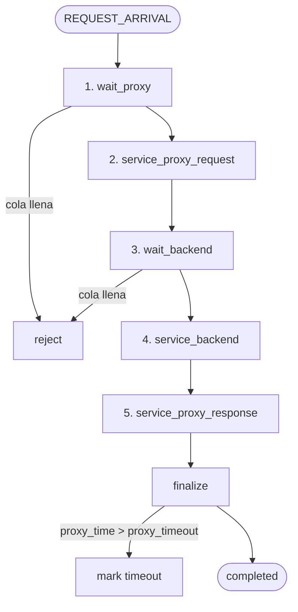

# Flujo del simulador

Este diagrama muestra las 5 etapas que recorre un request desde que llega al
proxy hasta que se completa, más los puntos de salida posibles (reject por
cola llena, timeout por deadline del proxy, o completed normal).

**Cómo leerlo**:

- Las 5 etapas centrales (`S1` a `S5`) son **secuenciales**: cada request pasa
  por todas en orden.
- Las esperas (`S1`, `S3`) pueden terminar en `reject` si la cola
  correspondiente está llena.
- `finalize` puede terminar en `timeout` si el tiempo total acumulado en el
  proxy (`wait_proxy + service_proxy_request + service_proxy_response`)
  excede `proxy_timeout`, o en `completed` si todo salió bien.
- Si el proxy no hace CPU (`proxy_cpu_cost_request = 0` y
  `proxy_cpu_cost_response = 0`), las etapas 2 y 5 son instantáneas y la
  1 desaparece — el comportamiento colapsa a M/M/k puro.