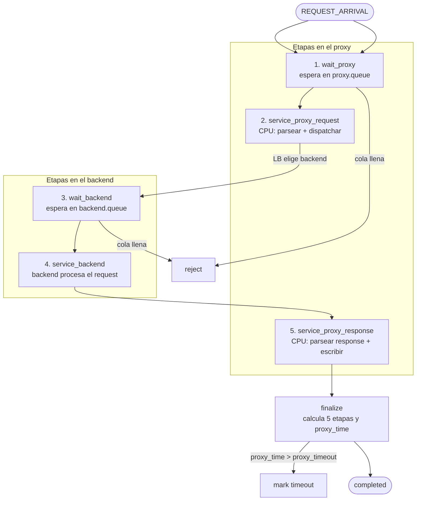

# Flujo del simulador

Este documento explica el flujo que recorre un request en el simulador,
desde que llega al proxy hasta que se completa (o se descarta).

## Componentes

- **Proxy**: modela el trabajo CPU del proxy reverse (parsing, dispatch).
  Tiene una cola (`proxy.queue`) y un CPU que atiende un request a la vez.
- **Backends**: uno o más servidores que procesan el request. Cada uno
  tiene su propia cola (`backend.queue`) y su propio servicio.
- **Load Balancer (LB)**: elige a qué backend mandar cada request
  (RoundRobin, Random, etc.).
- **EventLoop**: motor de la simulación. Despacha eventos en orden
  cronológico al handler correspondiente.

## Diagrama

## Descripción de cada etapa

1. **wait_proxy** — El request espera en `proxy.queue` su turno para
   usar la CPU del proxy. Si la cola está llena, el request se rechaza.

2. **service_proxy_request** — La CPU del proxy trabaja en el request:
   parsea headers, elige el backend vía LB, y lo encola. Instantánea
   si `proxy_cpu_cost_request = 0`.

3. **wait_backend** — El request espera en `backend.queue` su turno
   para que el backend lo procese. Si la cola está llena, se rechaza.

4. **service_backend** — El backend elegido procesa el request. Tiempo
   de servicio ~ Exp(μ).

5. **service_proxy_response** — La CPU del proxy trabaja en la response
   del backend: parsea headers, transforma body, escribe al cliente.
   Instantánea si `proxy_cpu_cost_response = 0`.

## Salidas posibles

- **reject**: la cola del proxy o del backend estaba llena cuando el
  request quiso encolarse. Status: `rejected`.
- **timeout**: en `finalize`, el tiempo acumulado en las 3 etapas del
  proxy (`wait_proxy + service_proxy_request + service_proxy_response`)
  excedió `proxy_timeout`. Status: `timeout`.
- **completed**: el request completó todas las etapas dentro del
  timeout. Status: `completed`. Se registran las 5 componentes de
  latencia.

## Modo degenerado: sin proxy

Si `proxy_cpu_cost_request = 0` y `proxy_cpu_cost_response = 0`, las
etapas 2 y 5 son instantáneas, la 1 desaparece (el proxy no tiene
cola porque no hay CPU que esperar), y el sistema colapsa a
**M/M/k puro**: llegadas Poisson → cola del backend → servicio
exponencial → done.